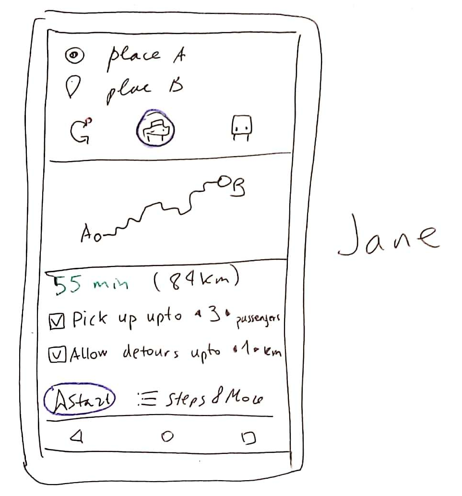
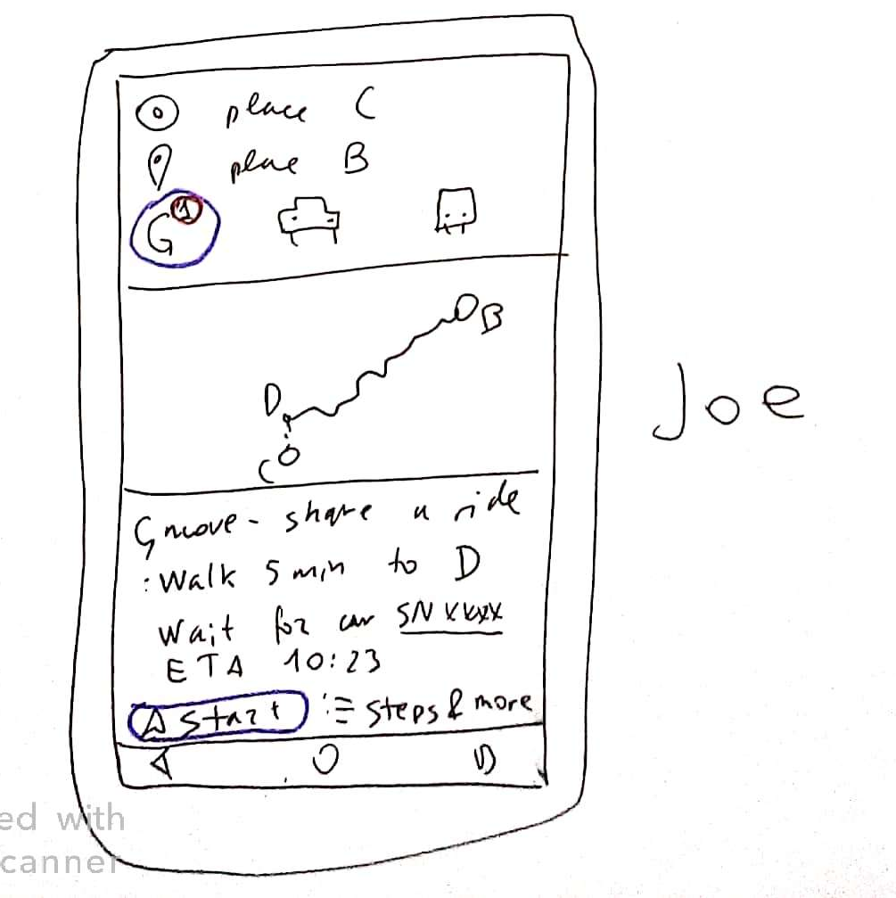

# GMOVE — a Google maps feature that could relief the climate crisis

Google’s mission is to organize the world’s information. This activity
has already changed the world in more than one way. Now, when humanity is
facing the climate crisis, it is
exhilarating to discover that by organizing certain information Google has a unique power to dramatically and
rapidly reduce global CO2. Unlike other “green technologies”, there’s no need to
wait 10–15–30 years to see the effects, but will start having impact as soon as
it is implemented (could be within a year).

The information that needs to be organized and made accessible this time is “who is going where (and doesn't mind helping with climate crisis)”. And the means to achieve this organization and access is by adding a single feature to Maps, a product already deployed on billions on smartphones worldwide.

# Description

The following user story illustrates the core functionality.

### Jane:

I live in the suburbs in place A. I’m about to drive to a place B downtown that I haven’t been to before. I’m going to drive alone and have three empty seats. I open google maps on my mobile, search for place B. I habitually select drive option (although a new ‘gmove’ option is presented as default). On the bottom of the screen directions appear, besides direction two new checkboxes appear (selected by default). One says ‘pick up up to 3 passengers‘ and has controls near 3 that enable adjusting this. The other says ‘allow detours up to 1 km’ with similar controls.

I don’t change anything and tap ‘Start’.

### Joe:
I live in the suburbs in place C, within 300m of route from A to B. I plan my drive to place B while sitting on a couch at home. I notice that the new ‘gmove’ means of transportation is present (and selected by default). The icon has a little red circle with number 1. This number is the number of drivers that are willing and able to take me to within 500m of B. The description of the route says “ Gmove –share a ride” and has walking instructions to a point D where I can be safely picked up by Jane. It also hase Jane’s ETA at D and walking instructions from C to D. I leave my car keys on the table, tap start and go to D.

### Jane:

3 minutes before I would have approached D I receive a notification that Joe will wait for me there, and that we will prevent 4.2 kg of CO2 from being emitted. Driving instructions changed so that I can pick up Joe at D. I follow the instructions.

### Joe:
I follow the walking instructions and arrive at D 5 minutes before Jane’s ETA. My phone’s screen now has a QR code that will allow Jane to know that I’m indeed her passenger (in case there happens to be more than one Joe at D).

### Jane:
I follow the instructions and pull over at D. I scan Joe’s QR code and we are both congratulated by our phones and encouraged to proceed with out common trip. Joe occupies the passenger seat and buckles up. Driving instructions resume and I continue driving. We have a hilarious chat with Joe about this new feature and how awesome and easy it is. We wonder how Google makes it work. Finally we arrive at B. The phone says “You have arrived at your destination AND prevented 4.2kg of carbon dioxide emissions. Way to go!” Joe thanks me , I thank him, and we part ways with a feeling of connection to humanity.

Other user stories are possible, but this would make this document too long.

# How much Global CO2 emissions could be prevented

Here are some upper bound estimates for a certain best case scenario.
I know that this is hyper optimistic, but it gives an impression of the scale of the potentional impact that could be achieved. As you'll see below it's pretty insane for something that is enabled by "purely software means". If you know how this upper bound could be improved, please share in an issue [here](https://github.com/madanh/gmove/issues).

## Outcome definition

Let’s define the best case scenario:
I. A cultural shift is induced and enabled by ‘gmove’. People give priority to this transportation option over driving, taking taxi, Uber or bus.

II. The cultural shift is so profound, that people who otherwise would consider buying a car, choose to rely on ‘gmove’.

<!--III. Gpackage (see Additional Features) is adopted.-->

## Outcome impact estimation
### I.

Let’s assume that all drivers adopt this and fill their free seats with other drivers. This means that the average car occupancy goes to 4.0 from the current number but the same number of users use less cars.

So, current number of cars in the world is estimated at

$$N_c=1.42\cdot10^9$$

Current [average car occupancy in UK](https://www.statista.com/statistics/314719) is

$$A_c = 1.55$$

If we extrapolate this to the world, then the total number of car users is

$$ Uc = Nc \cdot Ac = 2.2 \cdot 10^9 $$

Now let say that gmove + promotion campaign leads to a new car occupancy

$$A_n = 4.0$$

Then the new number of cars needed to transport Uc users is

$$ N_n = Uc/An=0.55 \cdot 10^9$$ 

By this estimate gmove would remove

$$ D_{cars} = N_n-N_c = 1.65 \cdot 10^9 $$

cars from active usage. Average annual CO2 emissions of a typical vehicle are estimated at

$$ F = 4.6 \cdot 10^3 kg $$

This leads to the net prevented CO2 emissions from part I of best case scenario of:

$$D_{i} = F \cdot D_{cars} = 7.59 \cdot 10^{12} kg = 7.59 Gt$$ CO2

This amount is taken from the “transportation” emission source.

### II.

Around 50% of CO2 emissions associated with a car happen during it’s manufacture. If gmove removes demand for 1.65*10⁹ new cars, this means that another

$$ D_{ii} = D_{i} = 7.59 Gt$$ CO2 

would stay in the form of unburnt fossil fuel. This part of saving would come from the “industry” emission source.

<!--

III.

I don’t quantify this contribution because it would be a fraction of the remaining emissions from transportation and would be negligible compared to I and II
-->
<!--
# Additional features

This list is nowhere near being exhaustive and is just something that I actually bothered to write down.

## Total CO2 prevented
Keep an account of total CO2 emissions prevented by all users and
display it when the driver plans the trip and after its completion . This might
incentivize some users. It also adds a base for possible future rewards
programs.

## Gpackage
Driver is given an option to pick and deliver a package along his course. This one is tricky, since it implies monetary incentives and a separate UI for the package sender. Monetary incentive is quite dangerous, since it may dramatically change the behavior and lead to reduced adoption not only of gpackage but also gmove.
-->

## Credit
Original idea for a mobile app implementing a platform for low-latency ride sharing and ad-hoc package delivery belongs to Marko Cafnik. I figured that it would take ages to for that app to come into use and it would be much better for the humanity if Google were to implement it in Maps. With Marko's blessing I set to reach decision makers at Google and persuade them to implement this.

## This document
This is only a draft and there's a lot of improvement to be done. If you can add to this document, have a comment or a question, please add a pull request or an issue on GitHub (https://github.com/madanh/gmove).

## Shoutout
If you know a way to make this a reality, please let me know at [madanh2014 @ gmail.com](mailto://madanh2014@gmail.com) or [raise an issue on GitHub](https://github.com/madanh/gmove/issues).
